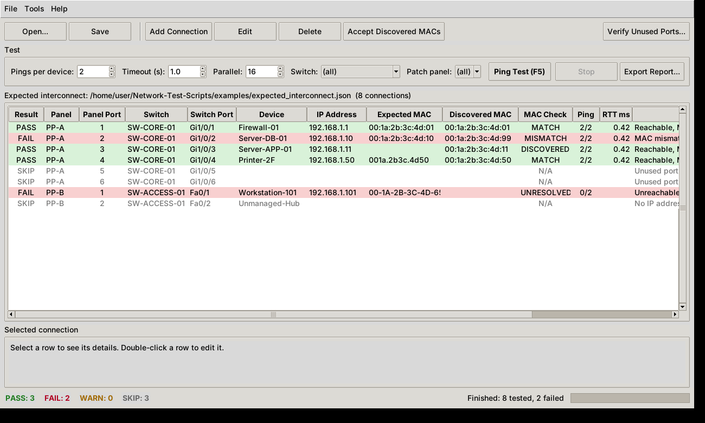
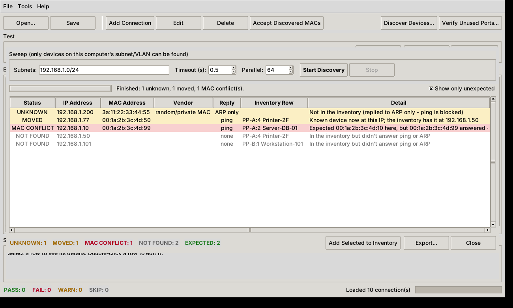
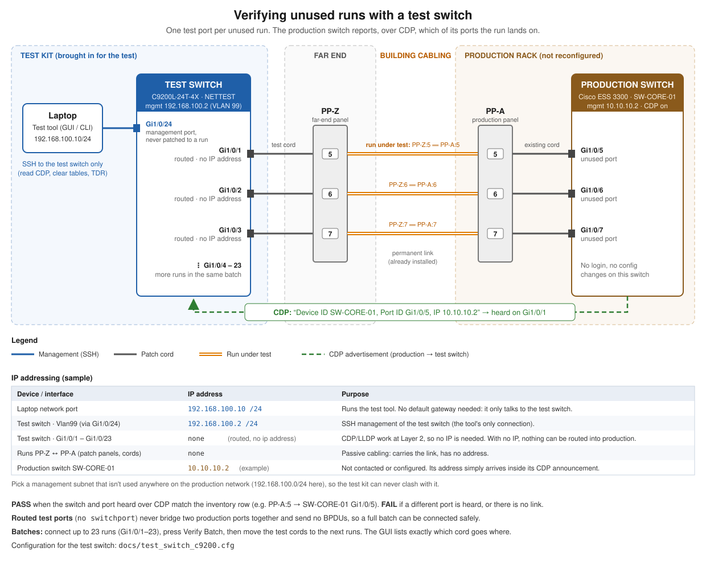
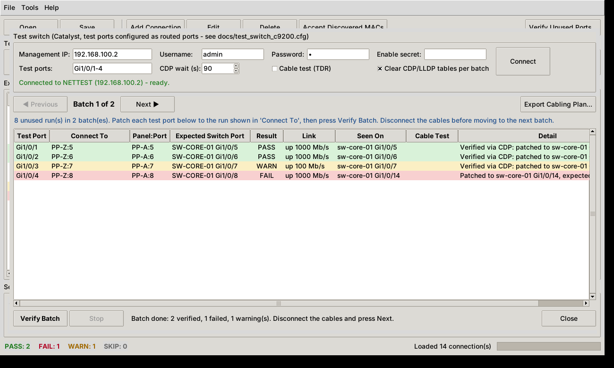
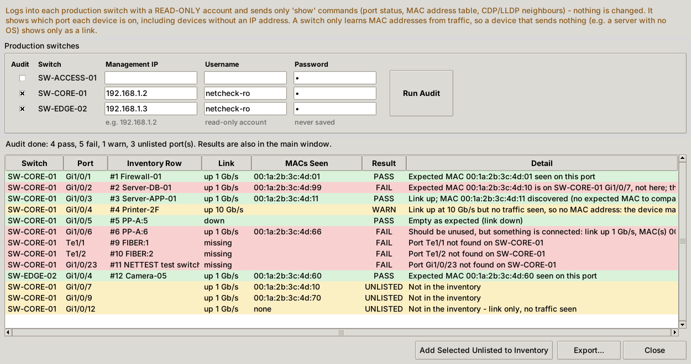

# Network Test Scripts

Tools for verifying a local network against its **expected physical interconnect**
(which device is patched into which patch-panel port and switch port).

Everything is available from the desktop GUI (`interconnect_gui.py`) or the command line.

**Connected devices** (`interconnect_test.py`):

- Ping every device that should be connected.
- Discover each device's MAC address from this machine's ARP/neighbour table.
- Compare the discovered MAC against the expected MAC.
- Capture a MAC "baseline" for devices whose MAC isn't recorded yet.

**Devices that aren't in the inventory** (`discover.py`):

- Ping every address in the chosen subnet(s) and read this computer's ARP table.
- List devices that answer but aren't in the inventory, devices that moved to a new IP, MAC
  conflicts, and inventory devices that didn't answer. Unknown devices can be added to the
  inventory.

**Unused runs** (`port_verify.py`), using a spare Cisco switch as a test probe:

- Patch test-switch ports to the far ends of unused runs, a batch at a time.
- Read the production switch's CDP/LLDP advertisement to see exactly which switch port
  each run lands on, and compare it with the expected port. Production switches are
  never logged into or reconfigured.
- Flag runs with no link, a degraded link speed, or (optionally) a cable fault found by
  the switch's TDR cable test.
- **Fiber (SFP+) runs:** check each channel links at the expected speed (e.g. 10G), that the
  transceiver light levels are within the module's limits, and that no errors occur while
  the link is watched. If there's no link, report whether the strands are probably reversed.

Every patch-panel port is reported as PASS / FAIL / WARN / SKIP, on screen and as CSV or JSON.

Possible future addition: read-only access to the production switches, to check the switch
port of each *connected* device from the MAC address table, and to check ports that are shut down.

## Requirements

- Python 3.8+ (standard library only, nothing to install). The GUI uses Tkinter, which
  is included with the python.org installers for Windows and macOS; on Linux install
  it with your package manager (e.g. `sudo apt install python3-tk`).
- The OS `ping` command. Works on Windows, Linux and macOS.
- A wired Ethernet connection with an IPv4 address: the tools never use Wi-Fi (see
  [Wired interface only](#wired-interface-only)).
- Run it from a machine on the **same subnet/VLAN** as the devices: MAC addresses are
  only visible via ARP for hosts on the local layer-2 segment. Devices behind a router
  will ping fine but show `UNRESOLVED` MACs (reported as WARN).
- Unused-run verification only: a Cisco IOS XE test switch (e.g. Catalyst C9200L-24T-4X-E; its 10G SFP+ uplinks are needed for fiber runs) and the
  Netmiko package: `pip install -r requirements.txt`.

## Desktop GUI



Start it with:

```sh
python interconnect_gui.py                      # then File > Open
python interconnect_gui.py my_network.json      # open a file straight away
```

On Windows you can double-click **`interconnect_gui.pyw`** to start it without a console window.

1. **Open** an expected interconnect file, or build one from scratch with **Add Connection**
   (one row per patch-panel port; the new row is pre-filled with the selected row's
   panel and switch). Double-click a row to **Edit** it. In the connection form, press
   **Help** (or **?** next to a field) for what each field means, an example, and how the
   tests use it. Mistakes such as invalid IPs or
   MACs and duplicate IPs, MACs or ports are caught as you enter them, and any invalid
   rows in an opened file are highlighted.
2. Pick the ping settings and optionally a single **Switch** or **Patch panel**, then press
   **Ping Test** (F5). Rows turn green/red/yellow as results come in; **Stop** cancels the
   rest of the run.
3. Select a row to see the full details below the table. Click a column heading to sort.
4. **Accept Discovered MACs** records the MACs of devices that didn't have one yet
   (mismatched MACs are never overwritten), then **Save** (Ctrl+S).
5. **Verify Unused Ports...** opens the test switch window (see below).
6. **Export Report** saves all results, ping and port verification, as CSV (opens in Excel) or JSON.

## Discovering devices that aren't in the inventory

The ping test only checks the IPs you've listed. **Discover** sweeps whole subnets to find
everything else that's there.



In the GUI, click **Discover Devices...**. The subnets are pre-filled from the inventory's IP
addresses (their /24s), or from this computer's own address if the inventory has none. Enter
the **network**, not just the mask: `192.168.1.0/24`, or `192.168.1.0 255.255.255.0`, or several
separated by commas. Examples are shown under the box, along with this computer's address. If
the computer isn't on the subnet you entered, you're warned before the sweep starts. Press
**Start Discovery**. Each address gets one ping; a /24 takes about 5-10 seconds. Then this
computer's ARP table is read, which also catches devices that block ping. Each device found is
listed as:

| Status | Meaning |
|--------|---------|
| UNKNOWN | Answers, but its IP isn't in the inventory. |
| MOVED | A MAC from the inventory now answers at a different IP. |
| MAC CONFLICT | An inventory IP is answered by a different MAC: another device is using that IP. |
| NOT FOUND | An inventory IP in the swept subnets didn't answer ping or ARP. |
| EXPECTED | In the inventory with the right MAC (hidden unless *Show only unexpected* is unticked). |

Select UNKNOWN devices (Ctrl/Shift+click for several) and press **Add Selected to Inventory**.
They're added as `connected` rows with their IP and MAC; double-click each one in the main
window to fill in its patch panel and switch port, then Save. **Export...** saves the results as
CSV or JSON.

Command line:

```sh
python discover.py my_network.json                        # sweep the inventory's /24s
python discover.py my_network.json --subnet 192.168.1.0/24 --subnet 10.0.5.0/26
python discover.py --subnet 192.168.1.0/24 --all          # no inventory: list everything
python discover.py my_network.json -o found.csv --add-unknown my_network.with_new.json
```

Options: `-t` ping timeout (default 0.5 s), `-w` parallel pings (default 64), `--max-hosts`
(default 1024, a safety limit), `--all` (also list expected devices), `--oui FILE`. Exit code
`1` means something unknown, moved or conflicting was found.

Notes:

- **Same subnet/VLAN only.** MAC addresses (and ARP-only devices) are only visible for the subnet
  your computer is plugged into. Devices on other subnets may answer ping but show no MAC. Run
  Discover from each VLAN.
- **No physical port.** It finds devices but can't tell which switch port they're on.
- **Get permission first.** A ping sweep is light, but some sites have rules about scanning.
  The GUI asks you to confirm once per session.
- **Vendor names (optional).** Download the IEEE registry
  [`oui.csv`](https://standards-oui.ieee.org/oui/oui.csv) and save it as `netcheck/data/oui.csv`
  (or pass `--oui`) to see manufacturer names. Without it, only randomised / private MACs are
  labelled.

## Test setup



(A PNG copy for printing: [`docs/test_switch_setup.png`](docs/test_switch_setup.png).)

The laptop plugs into the Catalyst test switch, which sits between the laptop and the
production switch (SW-CORE-01). Any daisy-chained switch (SW-EDGE-02) hangs off SW-CORE-01.

- **Laptop → test switch → SW-CORE-01 → SW-EDGE-02.** On the test switch, the laptop port
  (Gi1/0/24) and the **production link** (Gi1/0/23) are switched together. Gi1/0/23 runs
  through a patch panel to an existing SW-CORE-01 access port in the devices' VLAN. The laptop
  is therefore on the devices' VLAN, so **Ping Test** and **Discover** reach devices on
  SW-CORE-01 *and* on SW-EDGE-02 (through SW-CORE-01's uplink), MAC addresses included. They
  can't tell which switch a device is on.
- **Addresses:** the laptop and the test switch's management each use a spare address in the
  devices' subnet (192.168.1.240 and 192.168.1.250 in the examples). Check with the network
  owner that they're free; Discover shows which addresses answer.
- **Only one production link.** Gi1/0/23 filters spanning-tree BPDUs so SW-CORE-01's BPDU guard
  isn't tripped. That's safe with a single link, but a second link between the test switch
  and production would create a loop nothing detects.
- **Test ports** (Gi1/0/1-22, and Te1/1/1-2 for fiber) stay routed and isolated: they verify
  unused runs (below) and never connect the laptop or each other to anything.
- **Production link in the inventory.** Add a `connected` row for it with the test switch's
  address, like `PP-A:23` in the example. Ping Test and Discover then recognise the test
  switch instead of reporting it as unknown.
- Nothing is configured on SW-CORE-01 or SW-EDGE-02. The only configuration goes on the test
  switch: [`docs/test_switch_c9200.cfg`](docs/test_switch_c9200.cfg).

## Wired interface only

The tools only ever use the laptop's **wired Ethernet** interface. Wi-Fi can stay switched on;
it's ignored, even if it's on the same subnet.

- **Pings** go out through the wired interface: `ping -S <address>` on Windows, `ping -I <name>`
  on Linux, `ping -b <name>` on macOS.
- **MAC addresses** are read only from the wired interface's ARP table.
- **Discover** sweeps and reads ARP on that interface, and its "This computer" hint and
  suggested subnet come from the wired address and its real prefix.
- **SSH to the test switch** leaves from the wired interface's address.

Wired adapters are found automatically: PowerShell's `Get-NetAdapter` on Windows (built-in, USB and
dock Ethernet), `/sys/class/net` on Linux, `networksetup` on macOS. Wi-Fi, Bluetooth and virtual
adapters are skipped. An adapter counts only when it's connected and has an IPv4 address
(link-local 169.254.x.x doesn't count).

- **GUI:** the **Wired interface** bar at the top of the main window shows the interface in use.
  - **One wired connection:** chosen automatically.
  - **Several (e.g. built-in plus a USB adapter):** pick one from the list.
  - **None:** the bar says so in red. Plug in the cable, set the address and press **Refresh**.
- **Command line:** `--list-interfaces` lists the wired interfaces. `--interface NAME` chooses one
  by name, alias, description or IP address; it's needed only when several are connected.
  `--interface any` lets the OS choose (Wi-Fi may then be used; not recommended).

## Verifying unused runs with a test switch

An unused run has no device to ping, so the test switch stands in for one: a test port is
patched to the far end of the run (see the diagram above).

When the link comes up, the production switch (e.g. an ESS 3300) advertises itself over
CDP, which Cisco switches send by default. The test switch then reports
"SW-CORE-01, port Gi1/0/5", and the tool compares that with the inventory.

**1. Set up the test switch once** with [`docs/test_switch_c9200.cfg`](docs/test_switch_c9200.cfg).
The important part is that the test ports are **routed ports** (`no switchport`). Routed
ports never bridge production ports together, so many runs to the same switch can be
connected at once without making a loop. They also send no BPDUs, so BPDU guard on the
production ports isn't triggered. The tool refuses to use test ports that aren't routed.

**2. In the GUI**, click **Verify Unused Ports...**:



1. Enter the test switch's management IP, username and password (the password is never
   saved), and the test ports to use, e.g. `Gi1/0/1-22`. Press **Connect**. The tool checks
   that CDP is on and that the test ports are routed and enabled.
2. The unused runs are split into batches, one test port per run. **Export Cabling Plan**
   gives a printable list of the batches.
3. Patch the test ports as listed in **Connect To**, then press **Verify Batch**. It waits
   (up to the CDP wait time, 90 s by default) until every port has heard its neighbour or
   has clearly no link.
4. Disconnect the cables, press **Next**, and repeat. The results also appear in the main
   window and in the exported report.

**Or from the command line**, which prompts for each batch:

```sh
pip install -r requirements.txt
# my_network.json = your inventory file (see "Describing the expected interconnect")
python port_verify.py my_network.json --host 192.168.1.250 --username admin --ports Gi1/0/1-22
```

Options: `--fiber-ports Te1/1/1-2` and `--fiber-soak SECONDS` for fiber runs, `--cable-test` (TDR), `--timeout SECONDS`, `--switch NAME` / `--patch-panel NAME`
filters, `-o report.csv`. The password can also come from `$NETCHECK_SWITCH_PASSWORD`, and an
enable secret from `$NETCHECK_ENABLE_SECRET`. Settings can be stored in the inventory instead
(see `test_switch` below).

| Result | Meaning |
|--------|---------|
| PASS | Neighbour heard on the expected production switch and port. |
| FAIL | Heard on a **different** switch or port (the message says which), or no link at all: check the test cable, the run, or whether the production port is shut down. |
| WARN | Right port but the link negotiated below 1 Gb/s or the cable test found a fault; or link up but no CDP/LLDP heard (CDP may be disabled on that production switch). |
| SKIP | Unused row with no `switch_port` to compare against, or a fiber run when no fiber test ports are set. |

### Fiber (SFP+) channels

Fiber runs, such as the multimode channels to the production switch's SFP+ ports, are tested the
same way, using the test switch's **SFP+ ports**. On a C9200L-24T-4X-E these are the 10G
uplinks Te1/1/1-4, fitted with 10GBASE-SR modules of the same type as the production end.

1. In the inventory, give each channel `"media": "fiber"` and `"expected_speed": "10G"` (in
   the GUI, the Media and Expected speed fields). `far_end` can name the fiber end labels,
   e.g. `"Fiber end P1/S1"`.
2. Set the **Fiber (SFP+) ports** (`Te1/1/1-2`) in the Verify Unused Ports window, or use
   `--fiber-ports Te1/1/1-2` or `"fiber_ports"` in `test_switch`. Fiber channels are verified
   in the same batch as copper runs.
3. For each channel the tool checks:
   - it lands on the expected production SFP+ port (CDP);
   - the link is up at the expected speed: anything slower is a FAIL;
   - **light levels** (DOM) from `show interfaces transceiver detail`: received power from the
     production switch, transmit power, temperature, voltage and laser current, against the
     module's own warning and alarm limits. The receive margin is reported, e.g.
     `Rx -2.8 dBm, 7.1 dB margin`. Below the warning limit is a WARN; below the alarm limit
     is a FAIL;
   - **errors:** the link is watched for 60 s (the *Fiber error check* setting, or
     `--fiber-soak`), and any receive (CRC/FCS) errors are a WARN.
4. **No link?** If **no light is received**, the fiber is almost always reversed: swap the P and
   S strands at one end. If light is received but there's no link, the strand in the other
   direction is broken or dirty, or the modules don't match.

The DOM readings are a health check, typically accurate to about ±2-3 dB. They don't replace
certifying the fiber with an optical loss test set. The preflight warns if a module gives no
DOM readings, or doesn't report as a 10G SFP+. If a third-party module is rejected (the port
goes err-disabled), see the note at the end of `docs/test_switch_c9200.cfg`.

Notes:

- **Hostnames:** set each row's `switch` to the production switch's **hostname**. The domain
  name is ignored, so `SW-CORE-01` matches `SW-CORE-01.plant.local`.
- **Stale entries:** between batches the tool clears the test switch's CDP/LLDP tables
  (`clear cdp table`), so an old entry can't give a false result. This needs privilege 15
  or an enable secret.
- **Cable test:** the TDR cable test briefly drops the link and adds about 10 s per batch.
  It runs after the CDP check.
- **Production switches:** they will log a new CDP neighbour when a test port connects.
  That's harmless, and nothing on them is changed.

## Switch port audit (needs read-only access)

Ping Test and Discover only see devices that have an IP address. The Switch Port Audit asks the
production switches themselves: it logs into SW-CORE-01, SW-EDGE-02, etc. with a **read-only**
account and reads their port status, MAC address tables and CDP/LLDP neighbours. That shows
**which port every device is really on, including devices with no IP address**.

**Only `show` commands are sent:** `show interfaces status`, `show mac address-table`,
`show cdp neighbors detail` and `show lldp neighbors detail`. There is no `enable`, no
`clear` and no configuration.

> **Limit:** a switch only learns a MAC address from frames the device sends. A device that sends
> nothing, e.g. a server with no OS installed and PXE boot off, never appears in a MAC table. Its
> port's **link and speed** are still visible, and the audit reports "link up at 10 Gb/s but no
> traffic seen" as a WARN.

**What the production switches need.** This is the only change to them, and it isn't made by this
tool. Ask the network owner for it; see
[`docs/production_switch_readonly.cfg`](docs/production_switch_readonly.cfg).

| Requirement | Usually already there? |
|-------------|------------------------|
| A **read-only** login: a local `privilege 1` user, or a read-only TACACS+/RADIUS role | No: this is the request |
| SSH enabled on the switch's management address | Usually yes |
| The management address reachable from the laptop (same subnet as the devices, through the test switch's production link) | Yes in this setup |
| `show mac address-table` etc. allowed at privilege 1 | Yes by default on IOS XE |
| LLDP (`lldp run`) | Optional: only to hear LLDP that devices send themselves |

**As part of the Ping Test (F5).** When the inventory has a `switches` section, **Check switch
ports** next to the Ping Test button is ticked. The first F5 asks for each switch's password,
which is kept in memory only until you close the program. Each run then:

1. **Pings** every device first. Each reply also makes the switch learn (or refresh) that
   device's MAC, and the ping gives the MAC that answers at each IP.
2. **Reads each switch** (read-only), then checks every row's port. When a row has no
   `expected_mac`, the MAC that answered its ping is looked for on the port, so a device found
   at its IP is also confirmed to be on the right port.
3. **Combines** the two into one result per row, and the worse of the two wins. Example:
   `Ping: Reachable, MAC matches. Switch SW-CORE-01 Gi1/0/1: Expected MAC ... seen on this port`.
   - **Rows with no IP, and `unused` rows:** checked by the switch alone. If the MAC on the port
     is in the laptop's ARP table, the result says which IP it answers at.
   - **Uplink rows whose `device` names the neighbouring switch** (e.g.
     `"SW-EDGE-02 (daisy-chain uplink)"`): PASS when CDP/LLDP shows that switch on the port.
   - **Switches with no address, or that can't be logged into:** their rows keep the ping result
     only, and a warning says which switch failed.

Untick **Check switch ports** for a ping-only run. The ports in use that aren't in the inventory
are listed in **Audit Switch Ports...**, without logging in again.

**On its own**, click **Audit Switch Ports...**. Tick each switch to audit and enter its
management IP, read-only username and password (never saved). Then press **Run Audit**. The
results also appear in the main window. Ports with a link or traffic that the inventory
doesn't list are shown as **UNLISTED**; **Add Selected Unlisted to Inventory** adds them as new rows.



**Or from the command line** (it prompts for each password, or reads `$NETCHECK_SWITCH_PASSWORD`):

```sh
pip install -r requirements.txt
python switch_audit.py my_network.json                  # every switch in "switches"
python switch_audit.py my_network.json --switch SW-CORE-01 --host 192.168.1.2 --username netcheck-ro
```

Options: `-o report.csv`, `--no-colour`, `--interface`/`--list-interfaces`. Exit code `1` means
at least one FAIL or an unlisted port.

| Result | Meaning |
|--------|---------|
| PASS | The expected MAC is on the expected port; or, with no expected MAC, exactly one device is there (its MAC is shown and can be accepted). An `unused` port with no link. |
| FAIL | The expected MAC is on **another** port or switch (the message says where), a different device is on the port, no link, the link is slower than `expected_speed`, or an `unused` port has something connected. |
| WARN | Link up but no traffic (a silent device, see the limit above); several MACs on the port; or the port is an uplink to another switch. |

Uplinks (ports with a CDP/LLDP neighbour that is a switch, or more than 8 MACs) are skipped when
looking for devices. A device behind SW-EDGE-02 is found when SW-EDGE-02 itself is audited.

> The audit hasn't yet been run against a real ESS 3300. The first time, audit one switch and
> compare its results with `show mac address-table` on that switch.

## Describing the expected interconnect

`my_network.json` in the commands in this README stands for **your own** inventory file.
To make one, either:

- copy [`examples/expected_interconnect.json`](examples/expected_interconnect.json) to
  `my_network.json` and replace the example rows with your patch panels, switches and devices; or
- start the GUI (`python interconnect_gui.py`), use **Add Connection** for each patch-panel
  port, then **File > Save As**.

For the setup in the diagram above, [`examples/site/`](examples/site) has a starting point.
Every file includes the test switch settings, so the test switch needs no inventory file of its own.

| File | Covers | Use it for |
|------|--------|------------|
| `sw-core-01.json` | SW-CORE-01 only: the production link, the uplink, an unused run and both fiber channels | Testing just the production switch |
| `sw-edge-02.json` | SW-EDGE-02 only: the uplink, Camera-05 and an unused run | Testing just the daisy-chained switch |
| `site_both_switches.json` | Both switches together | Testing everything in one run, and for **Discover**. With a single-switch file, Discover reports the other switch's devices as unknown. |

Rows whose notes say `EXAMPLE` are placeholders: replace them with your real devices and panels.

To try the tools first, use the example file itself, e.g.
`python port_verify.py examples/expected_interconnect.json ...`. Its switch names (`SW-CORE-01`
etc.) are made up, though, so port verification against your real switches will report them
as mismatches.

It is a JSON file with a top-level object containing a `connections` list, with one
entry per patch-panel port. See
[`examples/expected_interconnect.json`](examples/expected_interconnect.json).

```json
{
  "description": "Building 1, comms room",
  "connections": [
    {
      "patch_panel": "PP-A",
      "panel_port": 1,
      "switch": "SW-CORE-01",
      "switch_port": "Gi1/0/1",
      "device": "Firewall-01",
      "ip": "192.168.1.1",
      "expected_mac": "00:1a:2b:3c:4d:01",
      "status": "connected",
      "notes": "Default gateway"
    },
    {
      "patch_panel": "PP-A",
      "panel_port": 5,
      "switch": "SW-CORE-01",
      "switch_port": "Gi1/0/5",
      "status": "unused",
      "far_end": "PP-Z:5"
    }
  ],
  "test_switch": {
    "host": "192.168.1.250",
    "username": "admin",
    "ports": "Gi1/0/1-22"
  }
}
```

Connection fields (all optional; omit or use `null` for "not set"):

| Field          | Description                                                     |
|----------------|-----------------------------------------------------------------|
| `patch_panel`  | Patch panel name, e.g. `"PP-A"`                                 |
| `panel_port`   | Port on the patch panel (string or number)                      |
| `switch`       | Switch the panel port is cabled to                              |
| `switch_port`  | Switch port, e.g. `"Gi1/0/1"`                                   |
| `device`       | Name of the device that should be on the far end                |
| `ip`           | Device IP address (omitted = can't be pinged, entry is skipped) |
| `expected_mac` | Expected MAC; any common format (`aa:bb:..`, `AA-BB-..`, `aabb.ccdd.eeff`) |
| `status`       | `"connected"` (default) or `"unused"`                           |
| `media`        | `"copper"` (default) or `"fiber"`: fiber runs use the test switch's SFP+ ports |
| `expected_speed` | Speed the run must link at when tested, e.g. `"10G"`; slower is a FAIL |
| `far_end`      | Where to plug the test switch in to reach this run, e.g. `"PP-Z:5"` |
| `notes`        | Free text                                                       |

The optional `test_switch` section stores the test switch settings: `host`, `username`,
`ports` (a range string or a list), `fiber_ports` (SFP+ test ports for fiber runs),
`fiber_soak` (seconds to watch fiber links for errors, default 60), `cdp_timeout` (seconds, default 90), `cable_test`
(default false), `clear_tables` (default true), `allow_switchports` (default false),
`device_type` (Netmiko type, default `cisco_xe`) and `ssh_port` (default 22). The GUI
fills it in for you. Passwords are never stored.

The optional `switches` section stores the production switches' login details for the
[Switch Port Audit](#switch-port-audit-needs-read-only-access), keyed by the switch names used
in the rows:

```json
"switches": {
  "SW-CORE-01": {"host": "192.168.1.2", "username": "netcheck-ro"},
  "SW-EDGE-02": {"host": "192.168.1.3", "username": "netcheck-ro"}
}
```

`device_type` (default `cisco_xe`) and `ssh_port` (default 22) are optional. The audit window
fills this in for you. Passwords are never stored.

JSON has no comments, so use `notes` or any extra field you like (e.g. `"cable_id"`).
Extra fields, and extra top-level keys such as `description`, are ignored by the
tests and preserved in the baseline file. The file is validated before testing:
JSON syntax errors are reported with line/column, and bad IPs/MACs, unknown
statuses, unused ports with IPs, and duplicate IPs, MACs, panel ports or switch
ports are all reported together, identified as `connection #N (panel:port)`.

## Command line

```sh
python interconnect_test.py examples/expected_interconnect.json
```

Useful options:

```text
-c, --count N            ping packets per device (default 2)
-t, --timeout SECONDS    wait per ping reply (default 1.0)
-w, --workers N          devices tested in parallel (default 16)
-o, --output FILE        write a report; .json for JSON, anything else is CSV
--write-baseline FILE    write a copy of the inventory JSON with missing
                         expected_mac values filled in from the discovered MACs
--switch NAME            only test rows on this switch (repeatable)
--patch-panel NAME       only test rows on this patch panel (repeatable)
-q, --quiet              no per-device progress
--no-colour              plain output
```

Exit codes: `0` no failures, `1` at least one FAIL, `2` invalid input / ping not available.

### Recording MACs for the first time

If you don't know the MACs yet, leave `expected_mac` out, then:

```sh
python interconnect_test.py my_network.json --write-baseline my_network.baseline.json
```

Only missing MACs are filled in; a MAC that doesn't match is reported as a FAIL and
never overwritten.

Check the baseline file is right, then use it as your expected interconnect from then on.

## Understanding the results

| Result | Meaning |
|--------|---------|
| PASS | Device replied to ping and its MAC matches (or was discovered, when no MAC was expected). |
| FAIL | Device didn't reply and no MAC was seen, **or** a *different* MAC answered for that IP (wrong device / IP conflict). |
| WARN | Device replied but its MAC couldn't be resolved (other subnet, or it's this machine's own IP); or it didn't reply to ping but did answer ARP (ICMP probably firewalled). |
| SKIP | `unused` port (checked with the test switch instead, see above), or a `connected` row the laptop can't find: no IP, and no MAC it has seen. The message says what to do. |

**Devices without an IP in the inventory.** Ping Test needs something to look for:

- **`expected_mac` but no `ip`:** the device is found by its MAC in the laptop's ARP table and pinged
  at the IP found there ("Found by MAC at 192.168.1.77"). The ARP table only holds devices the laptop
  has talked to, so run **Discover** first; its subnet sweep fills the table. Discover also lists the
  device as MOVED with "the inventory has no IP for it".
- **Neither `ip` nor `expected_mac`:** nothing on the laptop can tell which device is on, say,
  SW-EDGE-02 Gi1/0/8. Only the switch knows, so use the
  [Switch Port Audit](#switch-port-audit-needs-read-only-access). It reads that port's link and MAC
  straight from the switch's MAC table and fills in the MAC (needs read-only access). Without that,
  run Discover, identify the device among the unknown ones (vendor, MAC label), and add its IP or MAC to the row.

## Tests

```sh
python -m unittest discover -s tests -t .
```

The GUI tests are skipped automatically when Tkinter or a display isn't available.

## Layout

```text
interconnect_gui.py(w)    desktop GUI entry point (.pyw = no console on Windows)
interconnect_test.py      command-line ping/MAC test
port_verify.py            command-line unused-run verification with the test switch
discover.py               command-line discovery of devices not in the inventory
docs/test_switch_c9200.cfg  configuration for the Catalyst C9200L test switch
netcheck/inventory.py     JSON loading and validation
netcheck/ping.py          cross-platform ping
netcheck/mac.py           MAC normalisation and ARP/neighbour-table lookup
netcheck/checker.py       runs the checks and grades each connection
netcheck/report.py        console table, CSV/JSON report, baseline writer
netcheck/cli.py           command-line options
netcheck/gui.py           Tkinter desktop GUI
netcheck/gui_portverify.py  GUI window for unused-run verification
netcheck/portverify.py    batch planning, test-switch checks and grading of unused runs
netcheck/cisco.py         parsers for Cisco CDP/LLDP/interface/TDR output
netcheck/switch.py        SSH session to the test switch (Netmiko)
netcheck/portcli.py       command-line options for port_verify.py
netcheck/netif.py         finds the wired Ethernet interface(s) on Windows, Linux and macOS
netcheck/discover.py      subnet sweep, ARP table comparison and classification
netcheck/discovercli.py   command-line options for discover.py
netcheck/gui_discover.py  GUI window for device discovery
switch_audit.py           command-line read-only audit of the production switches
docs/production_switch_readonly.cfg  the read-only login to request on the production switches
netcheck/switchaudit.py   reads the production switches' tables and compares them with the inventory
netcheck/auditcli.py      command-line options for switch_audit.py
netcheck/gui_audit.py     GUI window for the switch port audit
```
